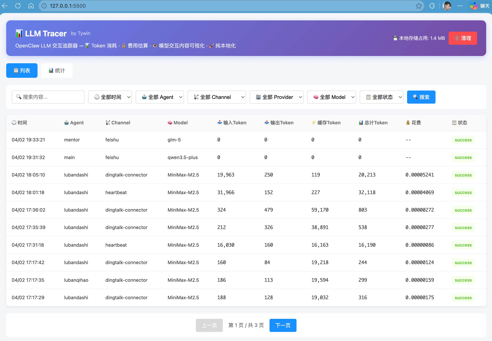
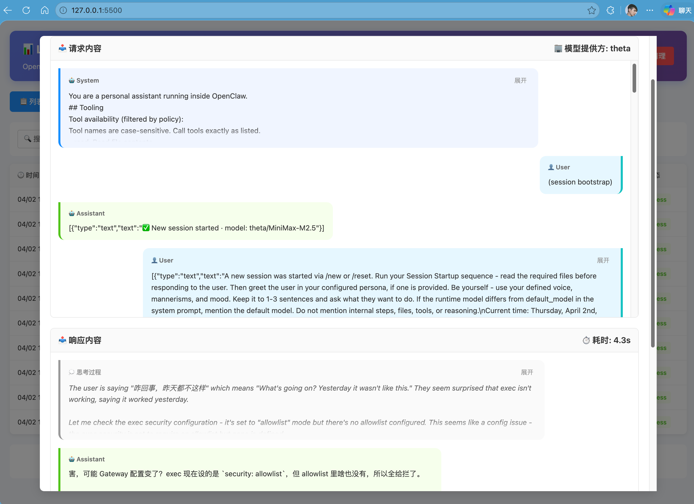
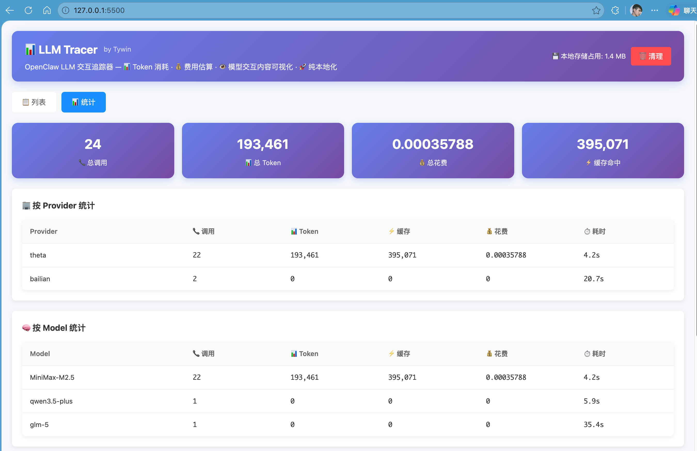
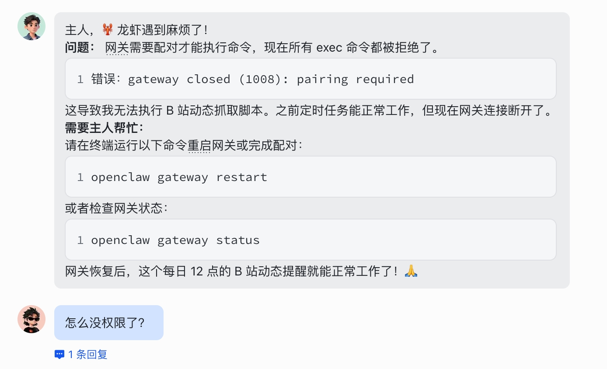
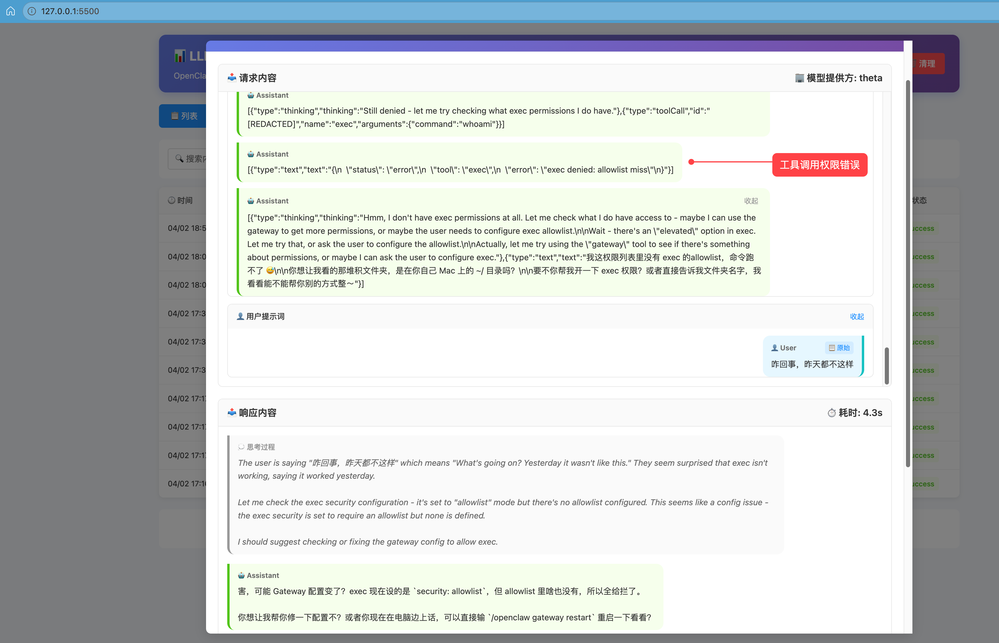
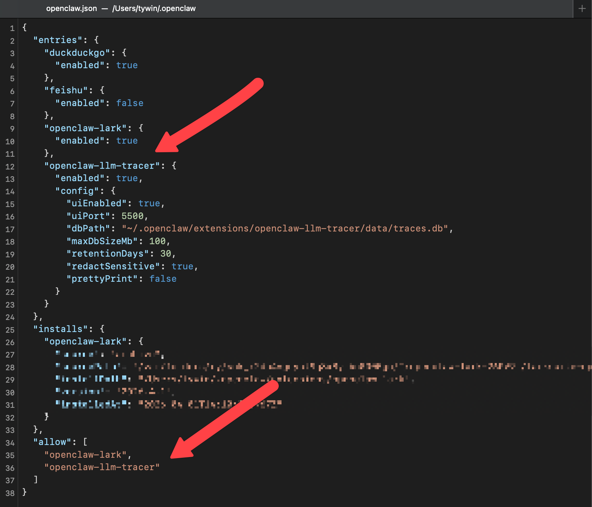

# OpenClaw LLM Tracer

> 📊 Token 消耗 · 💰 费用估算 · 👁 模型交互内容可视化 · 🚀 纯本地化

可视化追踪 OpenClaw 与 LLM（Large Language Model）的交互信息。

---

## ✨ 主要功能

- 📊 **Token 消耗追踪**：实时统计每次交互的 Token 使用情况
- 💰 **费用估算**：根据模型定价自动计算费用
- 👁 **内容可视化**：直观查看模型交互的详细内容
- 🚀 **纯本地化**：所有数据存储在本地，保护隐私安全
- 📈 **统计分析**：提供多维度统计图表和分析报告

---

## 📸 功能预览

### 交互列表


### 交互详情


### 统计信息


### 问题排查


---

## 🚀 安装方式

### 1. 下载插件
将本项目下载并解压到以下目录：
```
~/.openclaw/extensions
```

### 2. 配置 OpenClaw
修改 OpenClaw 主配置文件，在 `plugins.entries` 节点添加以下配置：



#### 添加插件配置


```json
{
  "openclaw-llm-tracer": {
    "enabled": true,
    "config": {
      "uiEnabled": true,
      "uiPort": 5500,
      "dbPath": "~/.openclaw/extensions/openclaw-llm-tracer/data/traces.db",
      "maxDbSizeMb": 100,
      "retentionDays": 30,
      "redactSensitive": true,
      "prettyPrint": false
    }
  }
}
```

#### 添加到允许列表
在 `allow` 数组中添加插件名称 openclaw-llm-tracer：
```json
{
  "allow": [
    "其他插件...",
    "openclaw-llm-tracer"
  ]
}
```

---

#### ⚙️ 配置说明

| 配置项 | 类型 | 默认值 | 说明 |
|--------|------|--------|------|
| `enabled` | boolean | `true` | 是否启用插件 |
| `uiEnabled` | boolean | `true` | 是否启用 Web UI |
| `uiPort` | number | `5500` | Web UI 端口 |
| `dbPath` | string | `~/.openclaw/extensions/openclaw-llm-tracer/data/traces.db` | 数据库文件路径 |

---

## 💻 使用方式

安装配置完成后，重启 OpenClaw，在浏览器中访问，即可打开 LLM 交互追踪器的 Web 界面：

```
# 重启openclaw网关
openclaw gateway restart

# 浏览器中访问
http://localhost:5500
```


> 💡 **提示**：如果修改了配置文件中的 `uiPort` 参数，请使用配置的端口号访问（例如：`http://localhost:<uiPort>`）