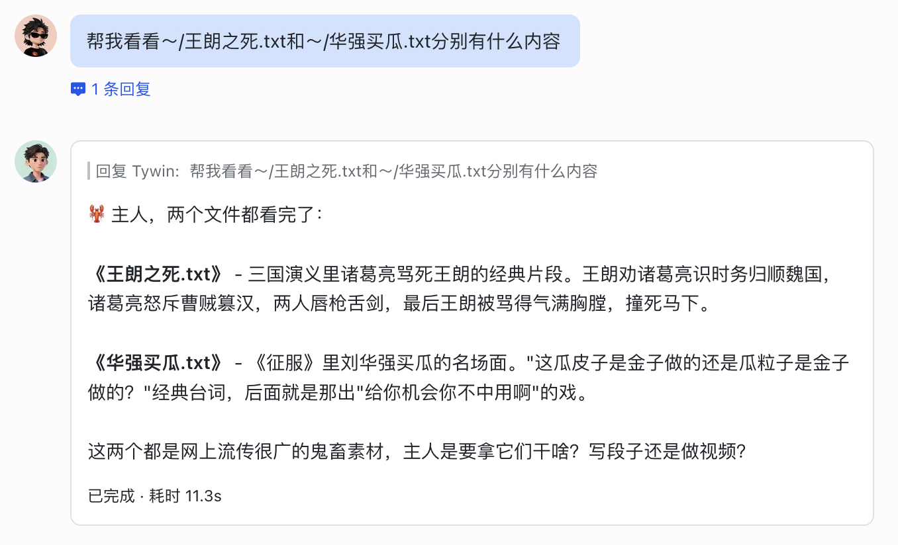
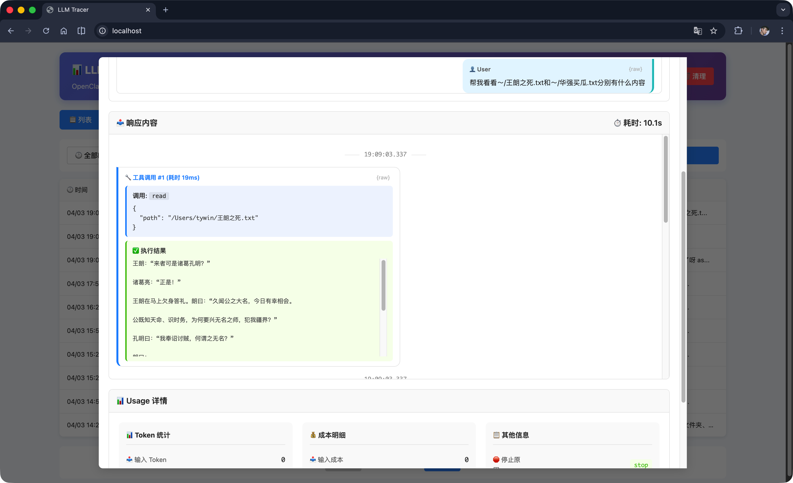
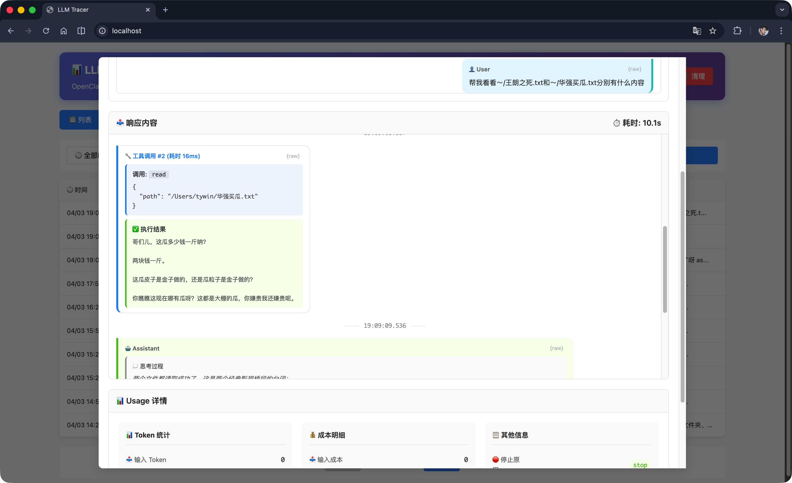
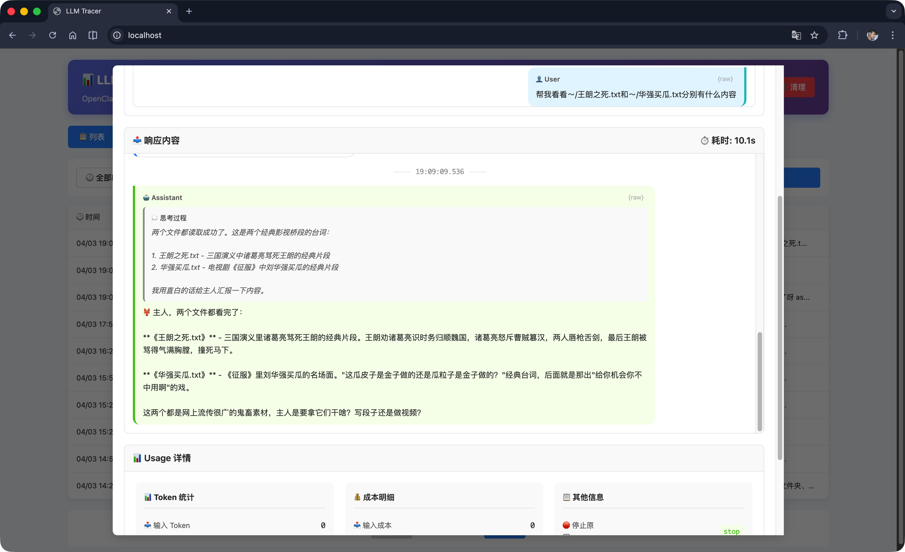
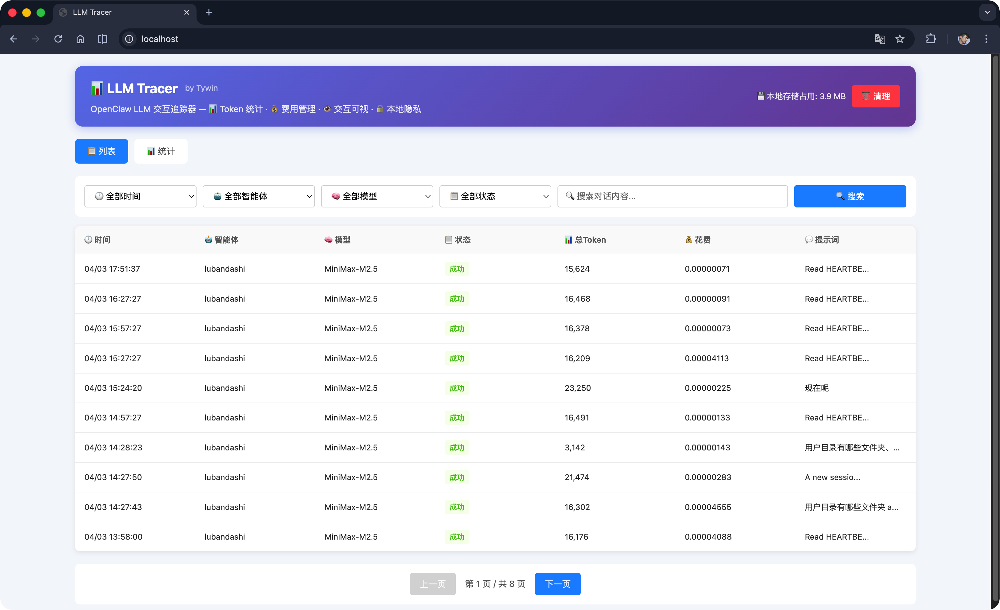
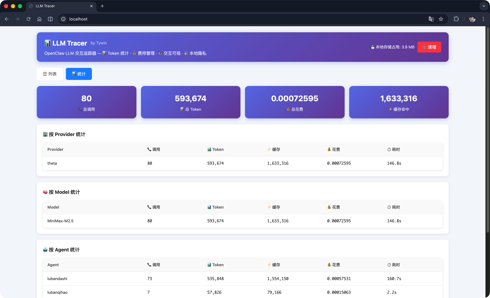
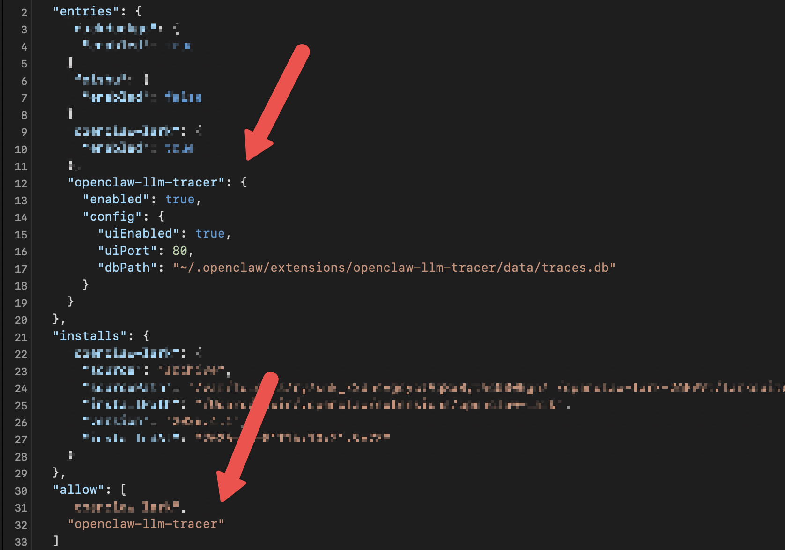

# OpenClaw LLM Tracer
OpenClaw LLM 交互追踪器 - 可视化追踪 OpenClaw 与 LLM（Large Language Model）的交互信息，包含工具调用的出入参内容、模型处理和返回的内容。  
龙虾从此不再是黑箱运行，所有操作有迹可循。

---

## ✨ 主要功能
- 📊 **Token统计**：实时统计每次交互的 Token 使用情况
- 💰 **费用管理**：根据模型定价自动计算费用，提供多维度统计图表和分析报告
- 👁 **交互可视**：直观查看模型交互的详细内容，便于问题排查追踪
- 🔒 **隐私保护**：所有数据仅存储在本地，其中敏感信息(apikey等)脱敏后再存储到本地，保护隐私安全。
---

## 📸 功能预览
### 交互追踪
#### 前台对话内容

#### 后台实际链路追踪
工具1调用和返回

工具2调用和返回

模型处理与最终响应


### 交互列表


### 统计信息


---

## 🚀 安装方式

### 1. 下载插件
将本项目下载并解压到以下目录：
```
~/.openclaw/extensions
```

### 2. 配置 OpenClaw
修改 OpenClaw 主配置文件，在 `plugins.entries` 节点启用 openclaw-llm-tracer 插件：



---

#### ⚙️ 配置说明（安装后默认已自动使用该配置，非特殊需求不需要配置该部分）

| 配置项 | 类型 | 默认值                                                         | 说明 |
|--------|------|-------------------------------------------------------------|------|
| `enabled` | boolean | `true`                                                      | 是否启用插件 |
| `uiEnabled` | boolean | `true`                                                      | 是否启用 Web UI |
| `uiPort` | number | `80`                                                        | Web UI 端口 |
| `dbPath` | string | `~/.openclaw/extensions/openclaw-llm-tracer/data/traces.db` | 数据库文件路径 |

---

## 💻 使用方式

安装配置完成后，重启 OpenClaw，在浏览器中访问，即可打开 LLM 交互追踪器的 Web 界面：

```
# 重启openclaw网关
openclaw gateway restart

# 浏览器中访问
http://localhost
```

> 💡 **提示**：如果修改了配置文件中的 `uiPort` 参数，请使用配置的端口号访问（例如：`http://localhost:<uiPort>`）